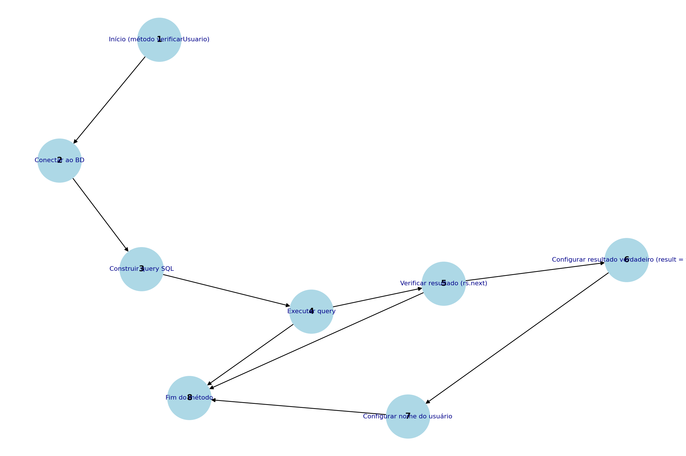

 Problemas Encontrados

1. Driver MySQL configurado incorretamente  
   - Linha de código: `Class.forName("com.mysql.Driver.Manager").newInstance();`  
   - Solução: Alterar para `Class.forName("com.mysql.cj.jdbc.Driver");`.

2. Erro na URL de conexão  
   - Linha de código: `String url = "jbdc:mysql://127.0.0.1/test?user=lopes&password=123";`  
   - Solução: Corrigir `jbdc` para `jdbc`.

3. Conexão não inicializada  
   - Problema: O método `conectarBD` não atribui valor à variável `conn`, resultando em uma conexão nula.

4. Risco de SQL Injection  
   - Local: Método `verificarUsuario`.  
   - Solução: Substituir a concatenação de strings por Prepared Statements.

5. Recursos não fechados  
   - Problema: Conexões, objetos `Statement` e `ResultSet` permanecem abertos, causando vazamento de recursos.  
   - Solução: Adotar o padrão `try-with-resources`.

6. Blocos `catch` sem tratamento adequado  
   - Problema: Exceções capturadas não são tratadas ou registradas, dificultando a identificação de erros.  
   - Solução: Adicionar logs ou exibir o stack trace.

7. Falta de validação de entrada  
   - Problema: As variáveis `login` e `senha` são usadas sem validação.  
   - Solução: Implementar verificações antes de processar os valores.

---

 Análise do Fluxo de Controle

O método `verificarUsuario` teve seu grafo de fluxo analisado, como ilustrado na imagem abaixo:

 Complexidade Ciclomática

A complexidade ciclomática foi calculada como 3, usando a fórmula:  
\[ M = E - N + 2P \]  

Onde:  
- E: Número de arestas = 8  
- N: Número de nós = 8  
- P: Número de componentes conectados = 1  

Conclusão: O código possui 3 caminhos básicos independentes.

 Descrição dos Caminhos Básicos

1. Caminho 1: 1 → 2 → 3 → 4 → 5 → 6 → 7 → 8  
   - Representa uma execução bem-sucedida com resultado obtido no banco de dados.

2. Caminho 2: 1 → 2 → 3 → 4 → 5 → 8  
   - Representa uma execução sem resultados encontrados.

3. Caminho 3: 1 → 2 → 3 → 4 → 8  
   - Representa a ocorrência de uma exceção durante a execução da query.

---

 Documentação e Comentários

 Objetivo

Na Etapa 4, o foco foi adicionar comentários e documentação ao código utilizando:  
- Comentários de uma linha (`//`)  
- Comentários de múltiplas linhas (`/ /`)  
- Javadoc (`/ /`) para detalhar classes, métodos e variáveis.

 Ações Realizadas

1. Inclusão de Comentários  
   - Comentários simples e explicativos foram inseridos diretamente no código para facilitar o entendimento.

2. Adição de Javadoc  
   - Toda a base de código foi documentada seguindo o padrão Javadoc. As classes, métodos e variáveis foram descritos com seus respectivos usos e parâmetros.

3. Geração da Documentação HTML  
   - O comando `javadoc` foi utilizado para gerar documentação em formato HTML, que está disponível na pasta `docs`.

4. Criação do README.md  
   - Um arquivo README foi elaborado para explicar as mudanças feitas e como acessar a documentação gerada.